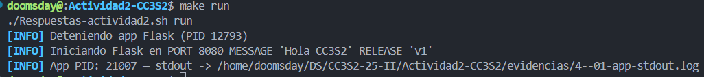
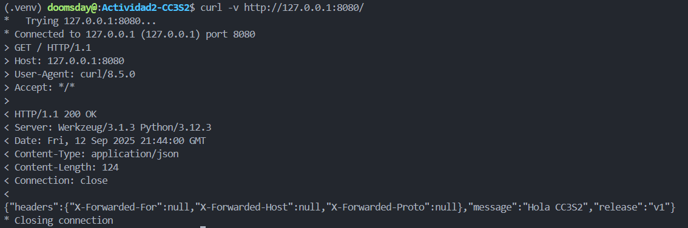
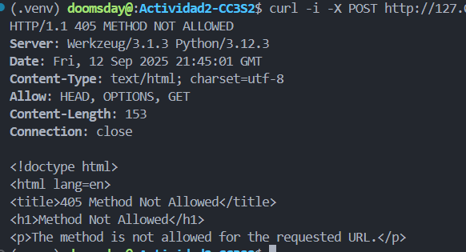
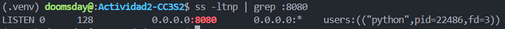
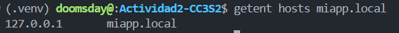
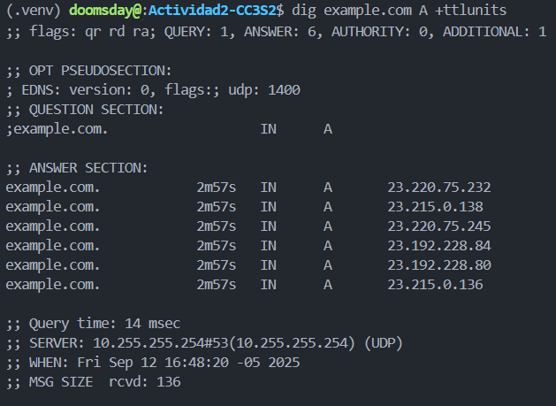
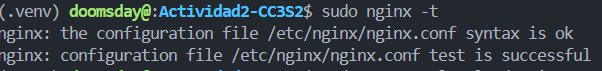
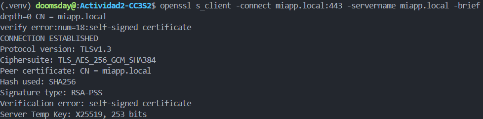
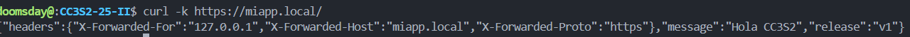
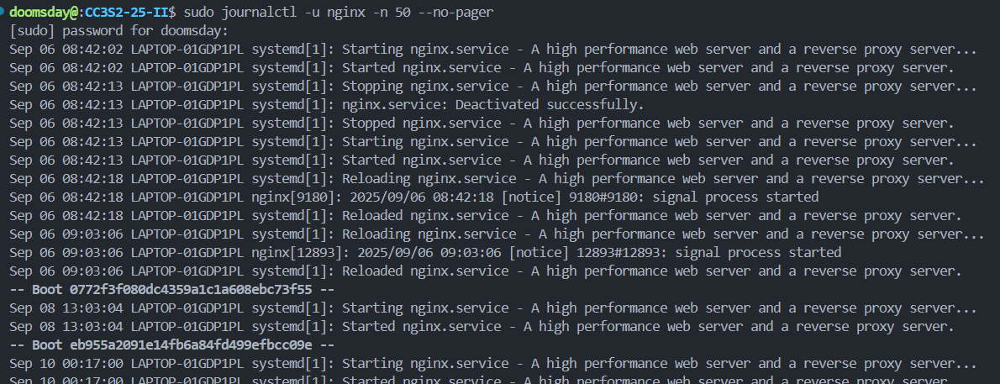

# Actividad 2: HTTP, DNS, TLS y 12-Factor - Reporte de Evidencias

## Respuestas a las Preguntas Guía

### 1. HTTP: Idempotencia de métodos y su impacto en retries/health checks

La idempotencia significa que ejecutar la misma operación múltiples veces produce el mismo resultado que ejecutarla una vez. Los métodos HTTP idempotentes son GET, PUT, DELETE y HEAD. POST no es idempotente.

En retries y health checks, la idempotencia es crucial porque permite repetir operaciones de forma segura si hay fallos de red. GET para health checks es seguro de repetir. PUT puede usarse para actualizaciones seguras porque establece un estado específico, mientras que POST puede crear múltiples recursos si se reintenta.

### 2. DNS: /etc/hosts vs zona DNS autoritativa y influencia del TTL

**/etc/hosts vs zona DNS autoritativa:**

/etc/hosts es un archivo local estático que el sistema operativo consulta antes de hacer consultas DNS. No tiene TTL ni delegación, solo mapea nombres a IPs de forma fija. Una zona DNS autoritativa vive en servidores DNS que responden consultas para su dominio con registros que tienen TTL y pueden delegar subdominios.

Para laboratorio, /etc/hosts es perfecto porque permite forzar resolución local sin depender de configurar servidores DNS reales o modificar DNS público. Es inmediato y controlable.

**Influencia del TTL:**

El TTL afecta cuánto tiempo los resolvers cachean respuestas DNS. TTL bajo significa más consultas frecuentes pero datos más actualizados. TTL alto reduce latencia al evitar consultas repetidas pero puede servir datos obsoletos más tiempo.

### 3. TLS: Rol de SNI en el handshake

SNI (Server Name Indication) permite que un servidor maneje múltiples certificados TLS en la misma IP y puerto, indicando qué nombre de host quiere el cliente durante el handshake TLS. Sin SNI, el servidor solo podría servir un certificado por IP.

**Demostración con openssl s_client:**

Con `openssl s_client -connect miapp.local:443 -servername miapp.local -brief` se demuestra SNI porque el parámetro `-servername` le dice al servidor qué certificado usar para miapp.local. Sin este parámetro, podría fallar o usar un certificado por defecto incorrecto. La opción `-brief` muestra información concisa del handshake incluyendo el certificado presentado y la versión TLS negociada.

### 4. 12-Factor: Por qué logs a stdout y config por entorno simplifican contenedores y CI/CD

**Logs a stdout simplifican contenedores y CI/CD porque:**
- La aplicación no maneja archivos de log, solo escribe al stream estándar
- El entorno (Docker, systemd, Kubernetes) se encarga de capturar, rotar y agregar logs
- Facilita centralización en sistemas como ELK, Loki o CloudWatch sin modificar la app
- Los contenedores pueden redirigir stdout a diferentes destinos sin reconfigurar la aplicación

**Config por entorno permite:**
- Mismo código binario en diferentes ambientes (dev, test, prod)
- Variables de entorno fáciles de inyectar en contenedores y CI/CD
- Separación clara entre código (inmutable) y configuración (mutable)
- Escalado horizontal sin recompilar, solo cambiando variables

### 5. Operación: Qué muestra ss -ltnp vs curl y triangulación con logs

**ss -ltnp muestra información que curl no puede ver:**
- Qué procesos (PID/nombre) están escuchando en qué puertos
- Estado de sockets (LISTEN, ESTABLISHED, etc.)
- Direcciones IP específicas donde se escucha (0.0.0.0 vs 127.0.0.1)
- Información de red a nivel del kernel, no de aplicación

curl solo muestra si puede conectarse y la respuesta HTTP, pero no qué proceso responde ni detalles del socket.

**Para triangular problemas se combina:**
- `ss -ltnp`: confirma que el proceso escucha en el puerto correcto
- `curl`: verifica conectividad y respuestas HTTP
- `journalctl -u nginx`: logs del servicio para errores de configuración, permisos, certificados
- Los logs de aplicación en stdout: errores internos de la app Flask

Esta combinación permite identificar si el problema está en red, proxy, aplicación o configuración.

---

## Evidencias por Actividad

### 1) HTTP: Fundamentos y herramientas

#### Levantamiento de la aplicación
**Comando ejecutado:**



#### Inspección con curl

**curl -v http://127.0.0.1:8080/**
```bash
curl -v http://127.0.0.1:8080/
```



**curl -i -X POST http://127.0.0.1:8080/**
```bash
curl -i -X POST http://127.0.0.1:8080/
```


**Explicación:** El método POST falla con 405 Method Not Allowed porque la ruta '/' solo acepta GET según la implementación de Flask.

**Respuesta a pregunta guía:** Si actualizas MESSAGE/RELEASE sin reiniciar el proceso, ningún campo de respuesta cambia en la aplicación en ejecución. Las variables de entorno se leen al iniciar el proceso (principio 12-Factor: Build/Release/Run). Cambiarlas en el shell actual no altera el entorno del proceso ya lanzado; debes reiniciar para que apliquen.

#### Puertos abiertos con ss
```bash
ss -ltnp | grep :8080
```



**Explicación 12-Factor:** Los logs no se escriben en archivo porque siguen el principio 12-Factor de tratar los logs como flujo de eventos. La aplicación escribe a stdout/stderr y el entorno (CLI, systemd, Docker) se encarga de capturar, rotar y enviar a herramientas de agregación. Esto simplifica el despliegue y permite redirigir logs sin modificar código.

### 2) DNS: nombres, registros y caché

#### Configuración de hosts local
**Archivo /etc/hosts modificado:**
Resolución local activa para miapp.local (127.0.0.1)

#### Comprobación de resolución


**getent hosts miapp.local**
```bash
getent hosts miapp.local
```


#### TTL/caché conceptual
**dig example.com A +ttlunits**
```bash
dig example.com A +ttlunits
```


### 3) TLS: seguridad en tránsito con Nginx

#### Certificado de laboratorio generado


#### Configuración de Nginx
**Snippet clave del server block:**
```nginx
server {
    listen 443 ssl;
    server_name miapp.local;

    ssl_certificate     /home/doomsday/DS/CC3S2-25-II/Actividad2-CC3S2/certs/miapp.local.crt;
    ssl_certificate_key /home/doomsday/DS/CC3S2-25-II/Actividad2-CC3S2/certs/miapp.local.key;

    add_header Strict-Transport-Security "max-age=31536000" always;

    location / {
        proxy_pass http://127.0.0.1:8080;
        proxy_http_version 1.1;
        proxy_set_header Host $host;
        proxy_set_header X-Forwarded-For $remote_addr;
        proxy_set_header X-Forwarded-Proto https;
        proxy_set_header X-Forwarded-Host $host;
    }
}
```

**nginx -t**



#### Validación del handshake

**openssl s_client -connect miapp.local:443 -servername miapp.local -brief**
```bash
openssl s_client -connect miapp.local:443 -servername miapp.local -brief
```


**curl -k https://miapp.local/**
```bash
curl -k https://miapp.local/
```



**Explicación de -k:** La opción -k (--insecure) le dice a curl que omita la verificación del certificado SSL/TLS. Es necesaria con certificados autofirmados porque no están firmados por una CA reconocida, pero permite probar la funcionalidad TLS del servidor.

#### Puertos y logs


**journalctl -u nginx -n 50 --no-pager**
```bash
sudo journalctl -u nginx -n 50 --no-pager
```




### 5) Operación reproducible

#### Tabla Comando -> Resultado esperado

| Comando | Resultado esperado |
|---|---|
| `PORT=8080 MESSAGE="Hola CC3S2" RELEASE="v1" python3 app.py` | La app escucha en :8080, hace logs JSON a stdout y responde JSON con `message` y `release`. |
| `curl -v http://127.0.0.1:8080/` | Muestra solicitud/respuesta con cabeceras, código 200 y cuerpo JSON. |
| `curl -i -X POST http://127.0.0.1:8080/` | Devuelve 405 Method Not Allowed (la ruta '/' solo acepta GET). |
| `ss -ltnp | grep :8080` | Socket TCP en LISTEN con el PID del proceso Python. |
| `dig +short miapp.local` | Devuelve 127.0.0.1 (por entrada en /etc/hosts). |
| `getent hosts miapp.local` | Resolución vía NSS; muestra 127.0.0.1. |
| `openssl s_client -connect miapp.local:443 -servername miapp.local -brief` | Handshake TLSv1.2/1.3 con certificado autofirmado; SNI correcto. |
| `curl -k https://miapp.local/` | Respuesta 200 con JSON; `-k` omite validación de CA por ser autofirmado. |
| `journalctl -u nginx -n 50` | Últimas líneas del servicio Nginx (si systemd). |
| `tail -f evidencias/4--01-app-stdout.log | head -n 5` | Demuestra logs como flujo redirigible por pipeline. |


---

## Comandos exactos utilizados

### HTTP
- `curl -v http://127.0.0.1:8080/`
- `curl -i -X POST http://127.0.0.1:8080/`
- `ss -ltnp | grep :8080`

### DNS
- `dig +short miapp.local`
- `getent hosts miapp.local`
- `dig example.com A +ttlunits`

### TLS
- `openssl s_client -connect miapp.local:443 -servername miapp.local -brief`
- `curl -k https://miapp.local/`
- `nginx -t`

### Logs y servicios
- `journalctl -u nginx -n 50 --no-pager`
- `tail -f evidencias/4--01-app-stdout.log | head -n 5`
- `systemctl status miapp`

### Make targets
- `make prepare`
- `make run`
- `make hosts-setup`
- `make dns-demo`
- `make tls-cert`
- `make nginx`
- `make tls-checks`
- `make logs-pipeline`

---
